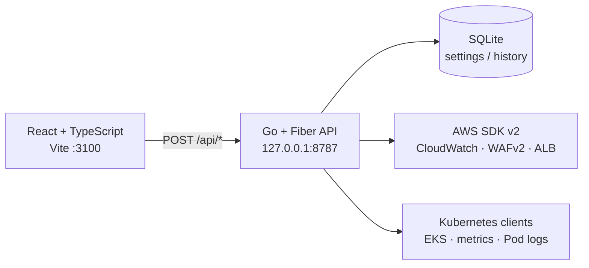

# Skills Dashboard

국가기능경기대회 클라우드컴퓨팅 트러블슈팅을 위한 **로컬 운영 대시보드**입니다. 하나의 화면에서 Kubernetes/EKS 상태, CloudWatch 지표, 애플리케이션·WAF 로그, 채점 입력값, WAF 규칙 수명주기, Deployment 조정과 사후 검증을 연결해 확인할 수 있습니다.

이 프로젝트는 운영자가 “지금 무엇이 이상한가”, “어떤 트래픽이 들어오는가”, “어떤 규칙을 적용할 것인가”를 순서대로 판단하도록 설계되었습니다. 대시보드는 점수를 임의로 계산하지 않고 관측된 근거와 채점기 입력값을 보여 줍니다.

> **보안 주의:** 대시보드와 API에는 사용자 인증이 없습니다. AWS 자격증명과 Kubernetes 접근권한을 사용하는 로컬 운영 도구이므로 반드시 loopback 주소로 실행하고, 외부에 직접 노출하지 마십시오.

## 주요 기능

| 영역 | 제공 기능 | 주요 데이터 소스 |
|---|---|---|
| **성능** | 채점기 입력값, TRT·4XX·5XX·RDS 연결 수, Pod/노드 상태와 사용률, Target Group 지표, 경고 이벤트, 이상 목록 | CloudWatch, EKS/Kubernetes API, CloudWatch Logs Insights |
| **트래픽** | 경로별 요청·차단, User-Agent·QueryString 패턴, 애플리케이션 요청 로그, WAF 로그, Pod 로그, 반복 오류 지문 | ALB/애플리케이션 로그, WAF 로그, Kubernetes API |
| **규칙 생성** | 의심 User-Agent 및 SQLi 규칙 조립, 정규식 패턴 세트 생성 안내, JSON 복사, 규칙 테스트, COUNT 실측, COUNT/BLOCK 전환, 정상 경로 프로브 | WAFv2, CloudWatch Logs Insights, 로컬 규칙 엔진 |
| **운영 제어** | Deployment Replicas·CPU·Memory Limit 변경, 변경 이력, 약 2분 후 결과 검증, 노드 수 비용·평균 투영 | Kubernetes API, SQLite |
| **설정** | 리소스 자동 탐색, 설정값 override, AWS CLI 세션 가져오기, 자격증명 확인, `.env` 내보내기 | AWS SDK/CLI, SQLite, kubeconfig |

전체 화면은 하나의 시간 창을 공유합니다. `15m`, `30m`, `1h`, `2h`, `4h` 중 하나를 선택하면 성능·트래픽·WAF 분석이 같은 구간과 버킷 기준을 사용합니다.

## 아키텍처



프런트엔드는 `src/`에 있으며 Vite 개발 서버가 `127.0.0.1:3100`에서 실행됩니다. 개발 중 `/api` 요청은 `vite.config.ts`의 프록시를 통해 `127.0.0.1:8787`의 Go API로 전달됩니다. 백엔드는 `backend/`에 있으며 Fiber가 모든 데이터 조회·변경 작업을 처리합니다.

백엔드 API는 읽기 작업을 포함해 모든 호출을 JSON `POST`로 통일하고, 다음 응답 봉투를 사용합니다.

```json
{ "ok": true, "data": {} }
```

오류가 발생해도 패널 전체를 중단하지 않고 다음 형태로 화면에 전달합니다.

```json
{ "ok": false, "error": "설명 가능한 오류 메시지" }
```

실제 AWS 또는 Kubernetes 자격증명이 없는 경우에도 로컬 순수 로직과 SQLite 기반 기능은 실행할 수 있습니다. 자격증명이 필요한 패널은 해당 패널에 오류를 표시하고 나머지 화면은 계속 동작합니다.

## 대상 환경

기본 설정은 다음 경기 환경을 가정합니다. 설정 화면에서 리소스 이름을 자동 탐색하거나 개별 override할 수 있습니다.

| 항목 | 기본값 |
|---|---|
| AWS workload region | `ap-northeast-2` |
| EKS cluster | `skills-eks` |
| ALB | `skills-alb` |
| RDS Proxy | `skills-db-proxy` |
| WAF Web ACL | `skills-waf` |
| WAF scope | `CLOUDFRONT` |
| WAF API region | `us-east-1` |
| Kubernetes namespace | `default` |
| 대상 Deployment | `user`, `product`, `stress` |

## 빠른 시작

### 사전 요구사항

Node.js 24와 pnpm, Go, AWS CLI, Kubernetes CLI가 필요합니다. 저장소는 `mise.toml`에 Node 24와 최신 Go를 선언하므로 [mise](https://mise.jdx.dev/) 사용을 권장합니다. EKS 접근을 위해 AWS 자격증명과 kubeconfig가 사전에 준비되어 있어야 합니다.

```bash
aws sts get-caller-identity
aws eks update-kubeconfig --name skills-eks --region ap-northeast-2
kubectl config current-context
```

### 설치

```bash
git clone https://github.com/rladnwls122/skills_dashboard-wooj.git
cd skills_dashboard-wooj

# mise 사용 시
mise install
mise run install

# mise를 사용하지 않을 때
corepack enable pnpm
pnpm install
go mod download -C backend
```

필요하면 `.env.example`을 복사해 리소스 이름과 실행 환경을 확인합니다.

```bash
cp .env.example .env
```

`.env`는 Vite가 읽는 프런트엔드 설정에 사용할 수 있지만, Go 백엔드는 `.env` 파일 자체를 파싱하지 않습니다. `API_ADDR`, `DB_PATH`, `CORS_ALLOW_ORIGINS` 및 리소스 관련 환경 변수는 실행 프로세스에 export하거나 `mise`, `direnv`, `dotenv-cli`와 같은 로더를 통해 주입해야 합니다.

### 개발 실행

프런트엔드와 Go 백엔드를 함께 실행합니다.

```bash
pnpm dev
# 또는
mise run dev
```

브라우저에서 [`http://127.0.0.1:3100/dashboard`](http://127.0.0.1:3100/dashboard)를 엽니다. 별도 로그인 화면은 없습니다.

개별 프로세스를 실행해야 하는 경우에는 두 터미널에서 다음 명령을 사용합니다.

```bash
# 터미널 1
pnpm dev:backend

# 터미널 2
pnpm dev:frontend
```

백엔드 상태는 다음과 같이 확인할 수 있습니다.

```bash
curl http://127.0.0.1:8787/healthz
# {"status":"ok"}
```

### 프로덕션 빌드 및 실행

```bash
pnpm build:clean
pnpm start
# 또는
mise run build-clean
mise run start
```

프런트엔드는 `dist/`에 빌드되고, 백엔드는 Windows에서 `api.exe`, 그 외 환경에서 `api` 실행 파일로 빌드됩니다. 빌드 캐시 문제를 피하려면 페이지 구조나 탭을 변경한 뒤 `pnpm build:clean`을 사용하십시오.

## 환경 변수

다음 변수는 `.env.example`에 전체 예시가 있습니다. 비밀값을 저장소에 커밋하지 마십시오.

| 변수 | 기본값 또는 예시 | 설명 |
|---|---|---|
| `AWS_ACCESS_KEY_ID` | 비움 | 선택적 AWS 액세스 키 |
| `AWS_SECRET_ACCESS_KEY` | 비움 | 선택적 AWS 시크릿 키 |
| `AWS_SESSION_TOKEN` | 비움 | 임시 자격증명 사용 시 필요 |
| `AWS_REGION` | `ap-northeast-2` | 기본 AWS 리전 |
| `WAF_SCOPE` | `CLOUDFRONT` | WAF Web ACL scope |
| `WAF_WEB_ACL_NAME` | `skills-waf` | 조회·변경할 Web ACL |
| `ALB_NAME` | `skills-alb` | ALB 이름, 비우면 자동 탐색 |
| `RDS_PROXY_NAME` | `skills-db-proxy` | RDS Proxy 이름 |
| `EKS_CLUSTER_NAME` | `skills-eks` | EKS 클러스터 이름 |
| `WAF_LOG_GROUP` | 비움 | WAF 상세 로그 그룹. 설정하면 Logs Insights 사용 |
| `TARGET_NAMESPACE` | `default` | Kubernetes namespace |
| `MAX_REPLICAS` | `20` | Deployment 조정 상한 |
| `DB_PATH` | `./data/dashboard.db` | 설정·이력 SQLite 파일 |
| `API_ADDR` | `127.0.0.1:8787` | Go API listen 주소 |
| `CORS_ALLOW_ORIGINS` | `http://localhost:3100,http://127.0.0.1:3100` | API 호출을 허용할 정확한 origin 목록 |
| `VITE_API_BASE_URL` | 비움 | 비우면 개발 프록시, 지정하면 API 절대 주소 사용 |

설정값은 **화면 override > 프로세스 환경 변수 > 내장 기본값** 순으로 결정됩니다. 설정 화면에서 저장한 값과 WAF/Deployment 변경 이력은 SQLite에 기록됩니다.

AWS 자격증명은 설정 화면에서 로컬 AWS CLI 세션을 가져오거나 직접 붙여 넣을 수 있습니다. 화면에는 마스킹된 값만 표시되며, 명시적으로 저장하도록 선택한 경우에만 SQLite에 평문으로 저장됩니다. 따라서 기본 운영 방식은 저장하지 않고 프로세스 메모리에서 사용하는 것입니다.

## 화면 사용 흐름

### 성능

성능 탭은 대회 중 계속 띄워 두는 감시 화면입니다. 상단에는 채점기 입력값과 노드 수 비용 투영이 배치되고, 이어서 TRT·4XX·5XX·RDS 연결 수, 이상 목록, Pod Health, Pod/Node 사용률, Target Group 지표, Warning Event Board, Deployment 조정 화면이 이어집니다.

채점기 입력값은 점수를 계산하는 카드가 아니라 Logs Insights에서 집계한 관측값입니다. 각 항목은 비율·정상 건수·전체 건수·데이터 출처를 함께 보여 주며, 기본적으로 5분 주기로 갱신됩니다. Deployment 변경은 현재 상태를 먼저 미리 보고 승인한 뒤 적용하며, 이후 이력 ID를 기준으로 결과를 검증합니다.

### 트래픽

트래픽 탭에서는 현재 요청이 어느 경로로 들어오고 어떤 User-Agent·QueryString 패턴이 관측되는지 확인합니다. 애플리케이션 요청 로그는 상태 코드 필터와 경로 검색을 지원하고, 행을 선택하면 마스킹된 원문을 볼 수 있습니다. WAF 로그는 BLOCK/COUNT/ALLOW 기준으로 필터링할 수 있으며, Pod 로그 터미널은 컨테이너 선택, 이전 컨테이너 로그, 최근 줄 수, 문제 로그 필터, 문자열 검색과 자동 갱신을 지원합니다.

규칙 생성으로 이동하는 진입점은 User-Agent 목록입니다. 미지정 경로는 ALB가 이미 404로 처리해야 하므로 경로 목록에서 WAF 규칙을 직접 만들지 않습니다. 모든 규칙은 제공 API 경로와 탐지 조건을 함께 평가하도록 scope-down됩니다.

### 규칙 생성

규칙 생성 탭은 WAF 규칙의 조립부터 적용 후 검증까지를 한 곳에서 다룹니다.

1. 관측된 User-Agent 또는 고정 SQLi 시그니처로 패턴 세트와 규칙 JSON을 조립합니다.
2. 정규식 패턴 세트를 먼저 AWS에 생성하고, 반환된 ARN을 규칙 JSON의 placeholder와 교체합니다.
3. 규칙 JSON을 로컬 테스트 요청으로 시뮬레이션합니다.
4. UA 규칙은 `추천됨 → BLOCK`으로 전환할 수 있고, SQLi 규칙은 `추천됨 → COUNT → BLOCK` 순서로 실측한 뒤 승격합니다.
5. COUNT 상태에서는 정상·비정상·조인 불가 건수를 분리해 오탐 근거를 확인합니다.
6. 적용 직후 정상 경로 프로브와 채점 입력값을 다시 확인합니다.

규칙을 내리는 작업은 현재 WebACL의 실제 상태를 기준으로 수행됩니다. 로컬 상태 플래그를 신뢰하지 않으므로 콘솔에서 직접 변경한 상태도 다음 조회에 반영됩니다.

## 안전장치와 운영 원칙

| 원칙 | 구현 |
|---|---|
| 로컬 전용 노출 | 프런트엔드 기본 주소는 `127.0.0.1:3100`, API 기본 주소는 `127.0.0.1:8787` |
| 변경 전 확인 | Deployment는 preview 후 승인하고, WAF는 화면의 명시적 전환 버튼으로 적용 |
| WAF 오탐 방지 | SQLi는 COUNT 실측 후 BLOCK 승격, 정상 경로 프로브 제공 |
| 경로 보존 | 조립·붙여넣기 규칙 모두 API 경로 scope-down 검사 통과 필요 |
| 데이터 근거 표시 | 지표명·집계 함수·시간 창·조회 건수·표시 건수를 함께 표시 |
| 부분 장애 허용 | AWS/Kubernetes 패널별 오류를 `ok:false`로 표시하고 다른 패널은 유지 |
| 비용 통제 | 시간 창은 최대 4시간으로 제한하고 Logs Insights 스캔 바이트를 표시 |

대시보드에는 인증 계층이 없으므로 `0.0.0.0` 바인딩, 공개 터널, 무심코 커밋한 자격증명은 금지해야 합니다. 다른 장치에서 접근해야 한다면 API와 프런트엔드를 공개 주소로 바꾸기보다 SSH 포트 포워딩을 사용하십시오.

## 테스트와 개발 명령

```bash
# TypeScript strict 검사
pnpm typecheck

# 프런트엔드와 백엔드 빌드
pnpm build

# Go 단위 테스트
cd backend
go test ./...
cd ..

# 출력물 정리
pnpm clean
```


백엔드 규칙 엔진, 분석 모듈, 자격증명 파서, SQLite 저장소와 API에는 Go 테스트가 포함되어 있습니다. 프런트엔드는 별도의 브라우저 E2E 스크립트보다 TypeScript strict 검사와 Vite build를 기본 검증으로 사용합니다.

## 프로젝트 구조

```text
.
├─ src/
│  ├─ app/dashboard/          # 대시보드 페이지와 성능·트래픽·규칙 UI
│  ├─ app/actions/            # UI가 사용하는 데이터 액션 호환 계층
│  └─ lib/                    # 타입, API 클라이언트, 자격증명 파서
├─ backend/
│  ├─ internal/api/           # Fiber 라우트와 ActionResult 응답 봉투
│  ├─ internal/service/       # 패널·운영 작업을 조합하는 서비스 계층
│  ├─ internal/awsx/          # AWS SDK v2 연동
│  ├─ internal/kube/          # Kubernetes/EKS 연동
│  ├─ internal/live/          # 실제 AWS/Kubernetes provider 구현
│  ├─ internal/rules/         # WAF 규칙 조립·시뮬레이션
│  ├─ internal/analysis/      # 이상 탐지·상관관계·인시던트 분석
│  └─ data/dashboard.db       # 로컬 설정·이력 저장소
├─ docs/RUNBOOK.md            # 대회 당일 운영 절차
├─ .env.example               # 환경 변수 예시
├─ mise.toml                  # Node/Go 버전과 반복 작업 정의
└─ package.json               # 프런트엔드·통합 실행 스크립트
```

대회 당일에는 구현 설명보다 [`docs/RUNBOOK.md`](docs/RUNBOOK.md)를 먼저 읽으십시오. README는 시스템 구조와 개발·운영 전제를 설명하고, RUNBOOK은 실제 상황에서 무엇을 확인하고 어떤 버튼을 누를지 설명합니다.

## API 개요

| 그룹 | 대표 엔드포인트 | 역할 |
|---|---|---|
| 패널 | `/api/kube-panel`, `/api/metrics-panel`, `/api/waf-panel`, `/api/grading-panel` | Kubernetes·CloudWatch·WAF·채점 데이터 조회 |
| 로그 | `/api/pod-logs`, `/api/request-log-rows`, `/api/waf-log-rows` | Pod·애플리케이션·WAF 로그 조회 |
| 설정 | `/api/settings`, `/api/settings/save`, `/api/discover` | 설정 조회·저장·자동 탐색 |
| 자격증명 | `/api/credentials`, `/api/credentials/import`, `/api/credentials/check` | 자격증명 주입·확인·삭제 |
| Deployment | `/api/deployment/preview`, `/api/deployment/patch`, `/api/verify` | 변경 사전 검증·적용·사후 검증 |
| WAF 운영 | `/api/assemble-rule`, `/api/test-rule`, `/api/waf-rule/update`, `/api/waf-evidence`, `/api/probe` | 규칙 조립·테스트·COUNT 근거·적용·정상 경로 확인 |

`GET /healthz`는 SQLite 연결을 포함한 백엔드 생존 상태를 확인합니다. 그 외 `/api/*` 호출은 JSON body를 사용하는 `POST`입니다.

## 문제 해결

| 증상 | 확인 순서 |
|---|---|
| 모든 패널이 비어 있음 | `http://127.0.0.1:8787/healthz` 확인 → AWS 자격증명 확인 → AWS region과 WAF scope 확인 |
| Kubernetes 패널만 비어 있음 | `kubectl config current-context`, `kubectl get pods -n default`, EKS 권한 확인 |
| WAF 패널만 비어 있음 | `WAF_WEB_ACL_NAME`, `WAF_SCOPE=CLOUDFRONT`, WAF API region `us-east-1`, WebACL 권한 확인 |
| 로그가 없음 | 공유 시간 창 확인 → 로그 그룹 이름 확인 → Logs Insights 스캔 범위와 실제 로그 유입 확인 |
| API 연결 오류 | 백엔드가 `127.0.0.1:8787`에서 실행 중인지 확인하고 `VITE_API_BASE_URL` 또는 Vite proxy 설정 확인 |
| 빌드는 되지만 페이지가 이상함 | `pnpm build:clean` 후 다시 빌드하고, 브라우저에서 `127.0.0.1:3100/dashboard`로 접속 |
| 임시 AWS 키가 만료됨 | 설정 → AWS 자격증명 → `aws CLI 세션 불러오기`로 세션을 다시 주입 |

## 라이선스

이 프로젝트는 [BSD 3-Clause License](LICENSE)로 배포됩니다.

## 참고 자료

[1]: https://vite.dev/guide/ "Vite 공식 문서"
[2]: https://gofiber.io/ "Fiber 공식 문서"
[3]: https://docs.aws.amazon.com/waf/latest/developerguide/ "AWS WAF 개발자 안내서"
[4]: https://kubernetes.io/docs/home/ "Kubernetes 공식 문서"

프로젝트의 실제 코드와 설정 파일이 이 README의 최종 기준입니다. 외부 서비스의 API 동작과 권한 요구사항은 해당 공식 문서도 함께 확인하십시오 [1] [2] [3] [4].
